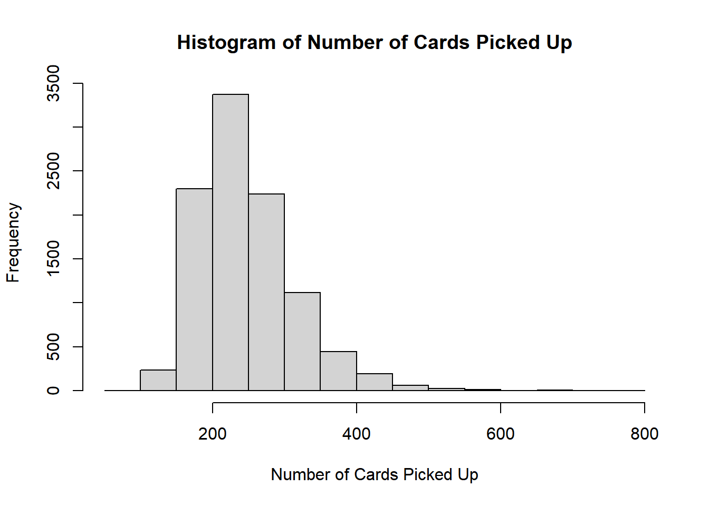

# Playing-Card-Simulation

## The Problem

Over the past four years I have collected playing cards I found on the street. In this time I have collected 16 of unique suit and value, and 18 total cards. The goal is to find a unique 54 card deck. I want to know how many cards I should expect to pick up to find a full unique deck.

## Simulation
I used R to simulate multiple runs of picking up random cards until a full unique (54) deck is found. I used the numbers from these runs to get an expected number of cards to find.

## Results
The average number of cards picked up to get a complete deck was 247. The minimum and maximum number of cards found was 88 and 795 respectively.

